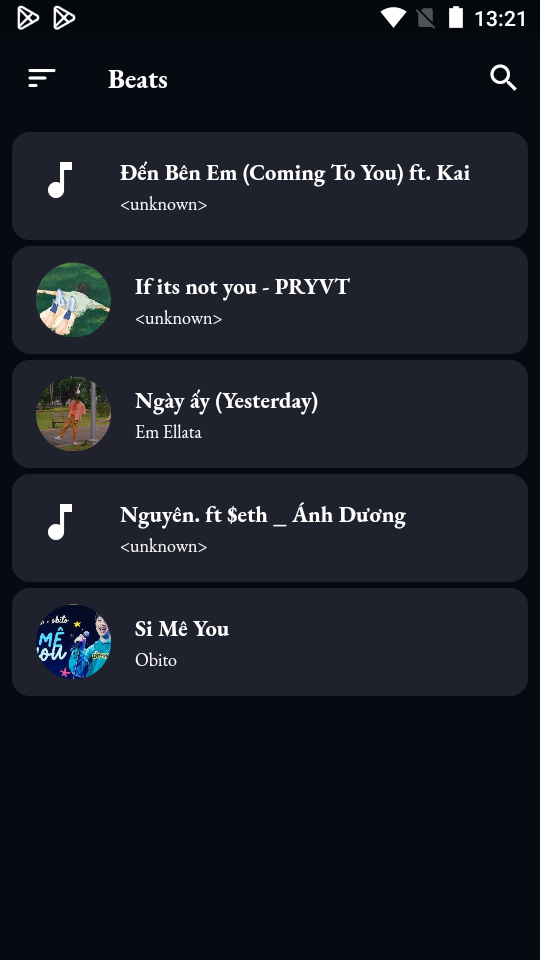
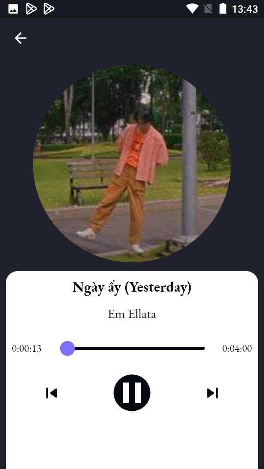
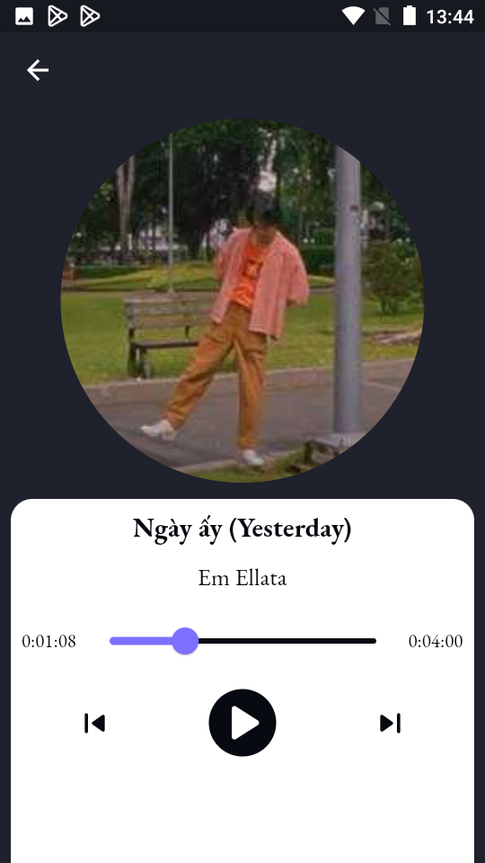

# Music Player App

## Introduction
Music Player App is a simple music player application built with Flutter. This app helps users enjoy music conveniently with a user-friendly interface and various useful features.

## Features

### 1. Music List
Displays a list of songs on your device, allowing users to easily search and select songs to play.



### 2. Play/Pause
Basic functionality allowing users to play or pause the current song.



### 3. Volume Control
Users can easily increase/decrease the volume to adjust according to their preferences.



### 4. Song Information
Displays detailed information about the currently playing song, including song name, artist, and duration.

### 5. Random Play Mode
Allows users to experience music in a new way by playing songs randomly.


## System Requirements
- Flutter 2.x
- Dart 2.x

## Installation
1. Clone the project from GitHub:

```bash
git clone https://github.com/your-username/music-player-app.git
